# 泰国与越南新车市场数据详细报告

> **数据截至**：2026-06　|　**生成日期**：2026-08-04
> **数据底座**：仓库 `data/market.db`（SQLite），所有销量/挂牌/新闻行均带 `source` / `source_url` / `source_name` / `source_site` 溯源字段。
> **配套产物**：16 张分析图表见 `data/analysis/`（下文以 `../data/analysis/xxx.png` 引用）；结构化简报见同目录 `thailand-market-review.md`、`vietnam-market-review.md`、`th-vs-vn-comparison.md`、`data-quality.md`。

---

## 一、执行摘要

| 维度 | 泰国（TH） | 越南（VN） |
| --- | --- | --- |
| 总数据行数 | **10,881** | **12,370** |
| 销量层（sales_monthly） | 1,286（FTI 51 + Publicity Top 1,235） | 12,210（VAMA 车型级） |
| 挂牌层（th_car_listings） | 9,575（Kaidee） | — |
| 新闻层（news_articles） | 20 | 160 |
| 销量覆盖窗口 | 2024-05 ~ 2026-06（FTI）；2024-08 ~ 2026-01（品牌/车型榜） | 2024-01 ~ 2026-06（30 个月） |
| 最新市场状态 | 2026-06 总量 58,724 台；乘用车电动化约 80.9% | 2026-06 总量 23,686 台；区域北重南轻 |

**五大核心结论**

1. **中国品牌在泰国与日系打平**：2026-01 全品牌口径下，中国品牌份额 **46.3%**（41,531 台），日本品牌 **46.2%**（41,391 台）——两者几乎并驾齐驱，中国品牌以不到 1 个百分点微弱领先。Toyota（23,546）仍是单一最大品牌，但 BYD（12,791）、Jaecoo（8,179）、MG（5,857）、GAC Aion（5,584）、ChangAn（3,879）已合力逼近日系总和。
2. **越南市场"北重南轻"**：30 个月累计，北部占 **44.0%**、南部 **36.1%**、中部 **19.9%**。与"越南车市集中在胡志明市（南）"的普遍印象相反，河内所在的北部才是最大区域市场。
3. **泰国电动化以乘用车口径极高**：在 FTI 公布动力类型细分的约 4.24 万台中，电动化车型（BEV+HEV+PHEV+REEV）占 **80.9%**，其中纯电 BEV 单月 22,275 台。越南 VAMA 数据不含动力类型细分，且 VinFast（最大 BEV 玩家）不在会员内，故越南"电动化率"在现有数据下无法直接计算——这是两国数据结构的关键差异。
4. **数据全溯源、零空值**：销量、挂牌两张表共 2.3 万行的溯源四字段空值均为 0；28 条 `data_quality_flags` 为已知边界的记录（非错误）。
5. **品牌重叠很小**：两国共同出现的品牌仅 5 个（Ford、Honda、Isuzu、Suzuki、Toyota）。泰国呈"日系 + 中国新势力 + 豪华品牌"的多元格局（49 个品牌名），越南则是"日系 + THACO 系（Kia/Mazda/Truck）+ 少量美系"的集中格局（15 个品牌）。

---

## 二、数据来源与方法

### 2.1 来源注册表

| 国家 | 类型 | 发布机构 | 抓取网站 | 覆盖内容 |
| --- | --- | --- | --- | --- |
| 🇹🇭 | 销量（总量/动力/皮卡） | FTI 泰国工业联合会（AutoLife Thailand 转载） | `autolifethailand.tv` | 月度总量 + 动力类型 + 1 吨皮卡段 |
| 🇹🇭 | 销量（品牌/车型榜） | Publicity Top | `publicitytop.com` | 月度品牌榜 Top~45 + 车型榜 Top~206 |
| 🇹🇭 | 挂牌/库存 | Kaidee（最大二手车/新车集市） | `kaidee.com` | 每条在售车广告一行 |
| 🇹🇭 | 新闻 | Headlight Magazine / AutoLife Thailand | `headlightmag.com` · `autolifethailand.tv` | 新车上市/市场资讯（RSS） |
| 🇻🇳 | 销量（车型级） | VAMA 越南汽车制造商协会 | `vama.org.vn` | 会员企业每款车月度销量，按北/中/南分区 |
| 🇻🇳 | 新闻 | VnExpress Ô tô / Tuổi Trẻ Xe / Thanh Niên Xe | `vnexpress.net` · `tuoitre.vn` · `thanhnien.vn` | 越南新车资讯（RSS） |

### 2.2 采集与建模方法

- **销量统一为"长表" `sales_monthly`**：每行 = `(国家, 年, 月, 层级, 品牌, 车型, 类别, 区域, 台数, YTD, 同比%, 是否小计, 来源四字段)`。`层级` ∈ {total, powertrain, segment, maker, model}。
- **泰国品牌/车型榜**来自 Publicity Top 的"粘连排名文本"，解析时**以可靠的"份额%"反推车型台数**（`台数 = round(份额% × 品牌月总量 / 100)`），并丢弃"台数超过品牌月总量"的损坏行——保证"车型之和 ≤ 品牌之和"的勾稽一致。
- **挂牌表 `th_car_listings`**：每行 = 一条 Kaidee 车源广告（品牌/车型/年份/价格/省份/里程/燃料/车况/卖家类型 + 溯源），与销量表共用同一套溯源纪律。
- **幂等写入**：`ON CONFLICT(...) DO UPDATE`，重跑不产生重复行。

### 2.3 覆盖边界与已知局限（透明披露）

1. **Kaidee 受服务端渲染（SSR）硬上限卡在 ~9,575 条**：网站宣称"9 万+ 在售"，但 SSR 浏览流实际只 serve 约 9,575 条独立车源，翻到约第 440 页后循环回第 1 页；价格/省份筛选参数被 SSR 忽略。故挂牌是"SSR 真实吐出的那部分快照"，非全站 9 万。
2. **Publicity Top 是 Top-N 排行榜**：只公布品牌前 ~45、车型前 ~206，榜外冷门车不在数据内。
3. **新闻是 RSS 近期窗口**：泰国 20 条、越南 160 条，均为近期条目，非全站历史归档。
4. **VAMA = 仅会员企业**：VinFast（及部分时段 Hyundai Thanh Cong）单独发布，不在内——越南销量是"VAMA 会员那块"，非全市场。
5. **FTI 佛历**：报告写 2569 年 = 2026 年（差 543），已自动转公历；部分月份只报月度或只报 YTD，缺失项不臆造。
6. **泰国品牌/车型榜最新只到 2026-01**（Publicity Top 未更新更晚月份），故泰国"品牌格局"分析锚定 2026-01；市场总量/动力类型则可用到 2026-06。

---

## 三、泰国市场深度分析

### 3.1 市场总量与趋势

FTI 月度总量（含部分月份缺口）在 **4.7 万 ~ 7.5 万** 台之间波动：2025 年底旺季冲至 **75,121**（2025-12）、**73,936**（2026-01），2026 年上半年回落至 **5.8 万** 左右（2026-06 = 58,724）。

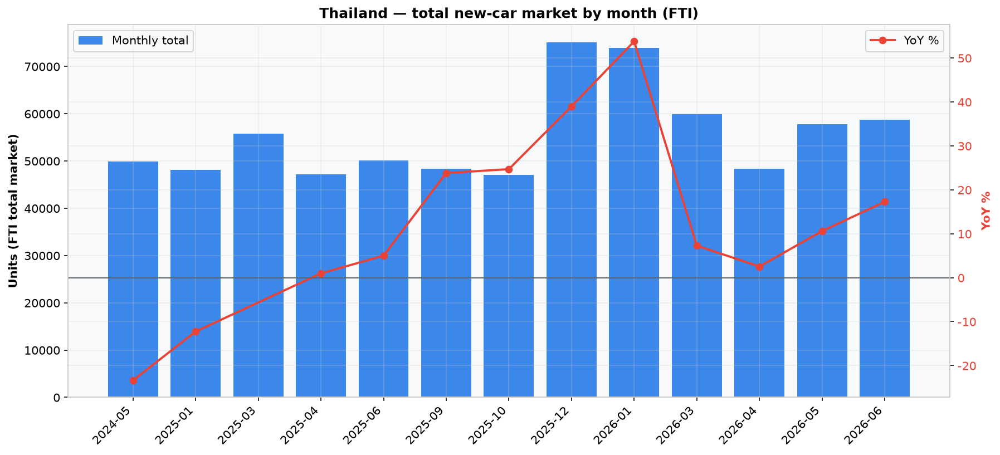

### 3.2 动力类型结构与电动化（2026-06）

| 动力类型 | 台数 |
| --- | --- |
| BEV 纯电 | 22,275 |
| HEV 混动 | 10,504 |
| ICE 燃油 | 8,114 |
| PHEV 插混 | 1,469 |
| REEV 增程 | 58 |
| **电动化合计** | **34,306（80.9%）** |

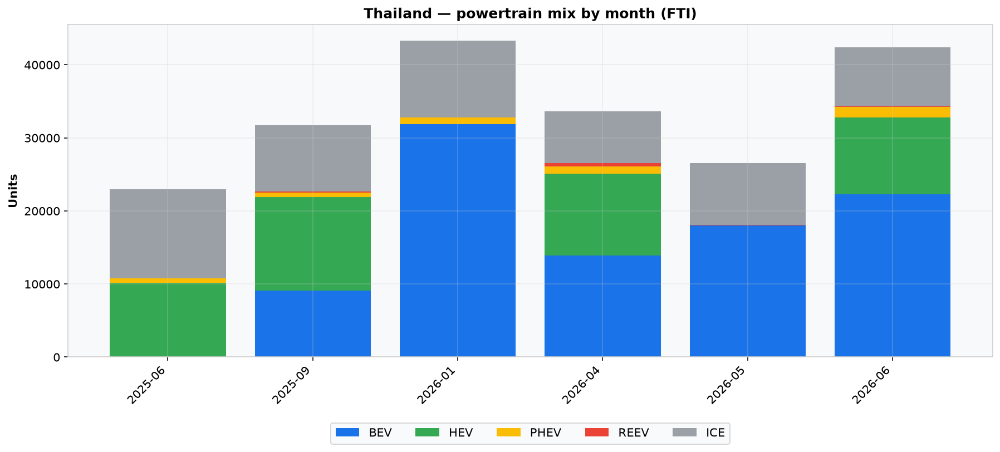

⚠️ **口径提示**：该动力类型细分合计约 **4.24 万台**，小于当月总量 58,724 台——差额为 1 吨皮卡等商用车（单列于 `segment` 维度，未进入动力类型拆分）。因此 **80.9% 是乘用车口径的电动化率**，代表 FTI 公布动力类型的那部分市场，不宜直接等同于"全市场电动化率"。

### 3.3 品牌格局：中国 vs 日本（2026-01，全品牌口径）

| 产地 | 台数 | 份额 |
| --- | --- | --- |
| 🇨🇳 中国 | 41,531 | **46.3%** |
| 🇯🇵 日本 | 41,391 | **46.2%** |
| 其他（美/欧/韩等） | 6,755 | 7.5% |

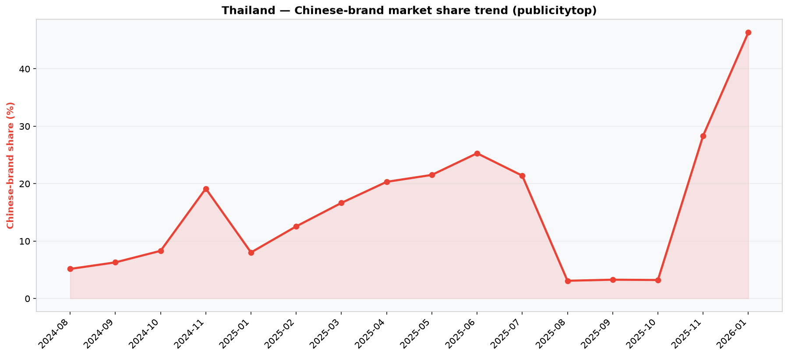

**单一品牌 Top 榜（2026-01）：**

| 排名 | 品牌 | 台数 | 产地 |
| --- | --- | --- | --- |
| 1 | Toyota | 23,546 | 日本 |
| 2 | BYD | 12,791 | 中国 |
| 3 | Honda | 8,181 | 日本 |
| 4 | Jaecoo | 8,179 | 中国 |
| 5 | Isuzu | 6,897 | 日本 |
| 6 | MG | 5,857 | 中国 |
| 7 | GAC Aion | 5,584 | 中国 |
| 8 | ChangAn | 3,879 | 中国 |
| 9 | Ora | 1,935 | 中国 |
| 10 | Ford | 1,832 | 美国 |

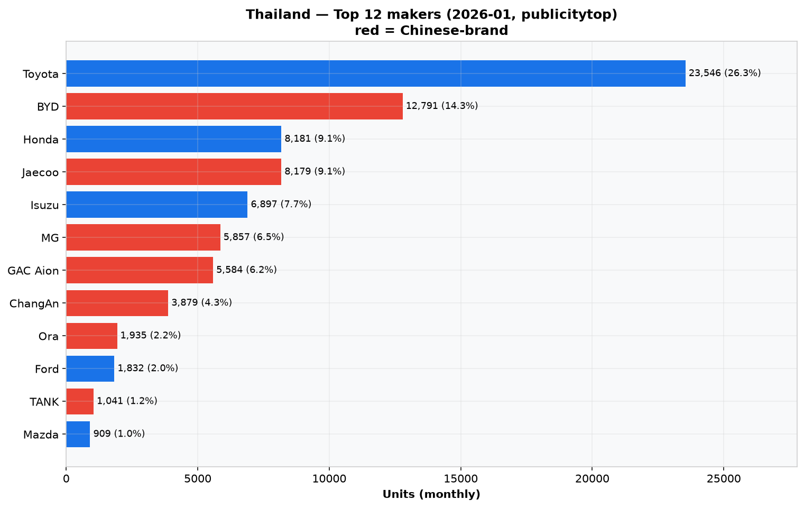

**解读**：Toyota 仍是绝对龙头，但中国品牌已整体逼近日系总和。BYD + Jaecoo + MG + GAC Aion + ChangAn + Ora 六大中国品牌合计约 **37,227** 台，与 Toyota+本田+Isuzu 三强日系（约 38,624）几乎持平。泰国是中国车企东南亚突围最成功的市场。

### 3.4 车型 Top 榜（2026-01）

车型榜由 Publicity Top 的 Top~206 解析而来，台数以"份额% × 品牌月总量"反推，已剔除损坏行。代表性头部车型（按品牌+车型）：BYD 多款（Atto/Seal 系列）、Jaecoo 5 EV、Isuzu D-Max、Toyota Hilux/YS Cross 等。完整 Top 20 见 `data/analysis/th_05_top_models.png` 与 `sales_th_monthly.csv`。

### 3.5 二手车/新车挂牌市场（Kaidee，9,575 条）

这是泰国的高体量"库存"图层，对应日本项目的 carsensor/goo-net 方法。

- **规模与结构**：9,575 条，覆盖 **45 个品牌、67 个府**；年份跨度 **1956–2026**；车况以**二手车为主（9,380，98%）**，新车仅 195 条。
- **价格**（THB，1 USD ≈ 36 THB）：中位数 **469,000**（≈1.3 万美元），均值 **624,911**，区间 25,000 ~ 44,890,000。
- **品牌分布**（挂牌数 Top）：

| 品牌 | 挂牌数 | 均价(THB) |
| --- | --- | --- |
| Toyota | 2,807 | 585,035 |
| Honda | 1,532 | 470,162 |
| Mazda | 672 | 383,432 |
| Isuzu | 639 | 562,084 |
| Ford | 631 | 624,691 |
| Mercedes-Benz | 603 | 886,651 |
| Mitsubishi | 530 | 466,155 |
| Nissan | 492 | 353,555 |
| BMW | 477 | 916,323 |
| MG | 200 | 344,489 |

- **地域极度集中**：曼谷（กรุงเทพมหานคร）**6,592 条（68.8%）**，其次暖武里（Nonthaburi）861、龙仔厝（Samut Sakhon）323、春武里（Chonburi）243。
- **燃料**：汽油（bensin）4,952（51.7%）、柴油（diesel）3,502（36.6%）、混动（hybrid）760（7.9%）。

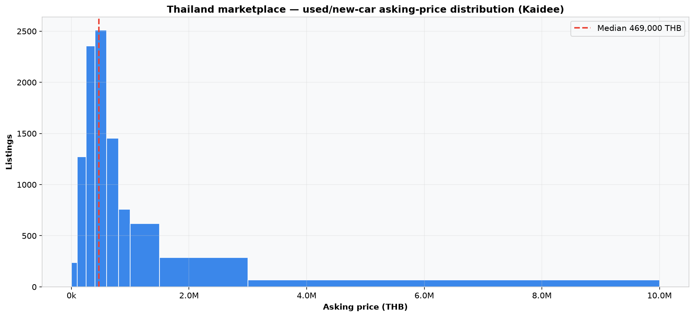　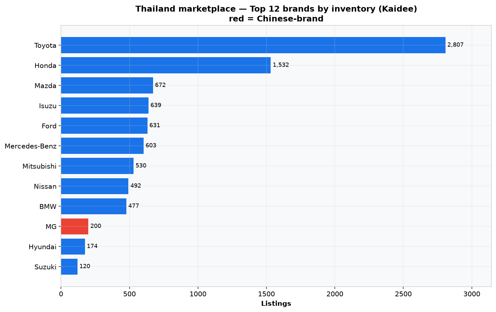　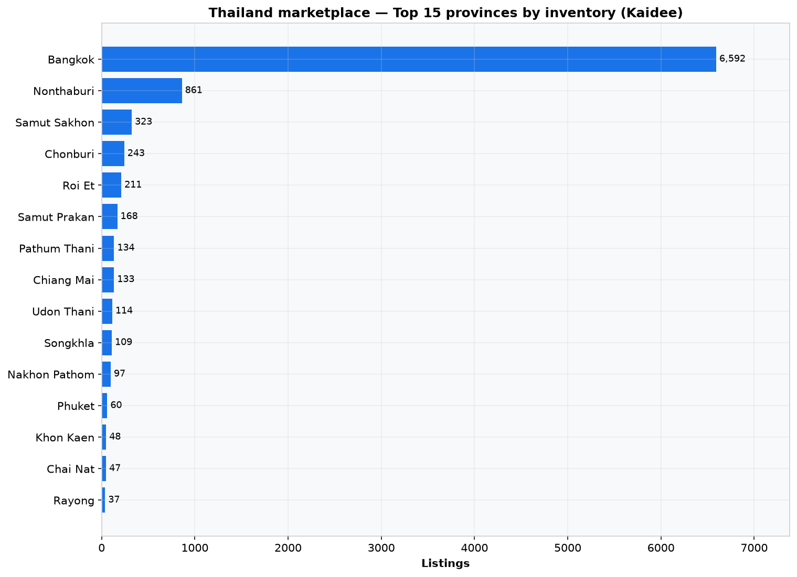　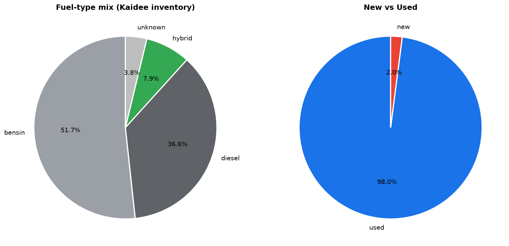

---

## 四、越南市场深度分析

### 4.1 市场规模与月度走势

VAMA 车型级销量 30 个月（2024-01 ~ 2026-06）呈明显**季节性**：岁末（11 月前后，春节前购车潮）冲高，**2025-11 达峰值 38,910 台**；节后 2 月回落（2024-02 仅 9,853）。2026-06 为 **23,686 台**。

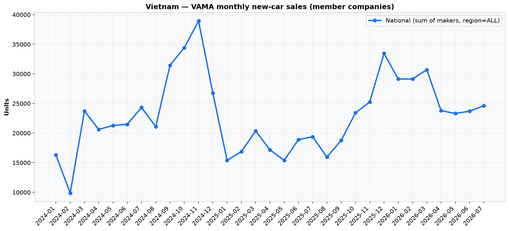

### 4.2 区域结构：北重南轻

| 区域 | 30 个月累计 | 份额 | 2026-06 当月 |
| --- | --- | --- | --- |
| 北部（North） | 303,942 | **44.0%** | 10,098 |
| 南部（South） | 248,891 | 36.1% | 8,952 |
| 中部（Central） | 137,251 | 19.9% | 4,636 |

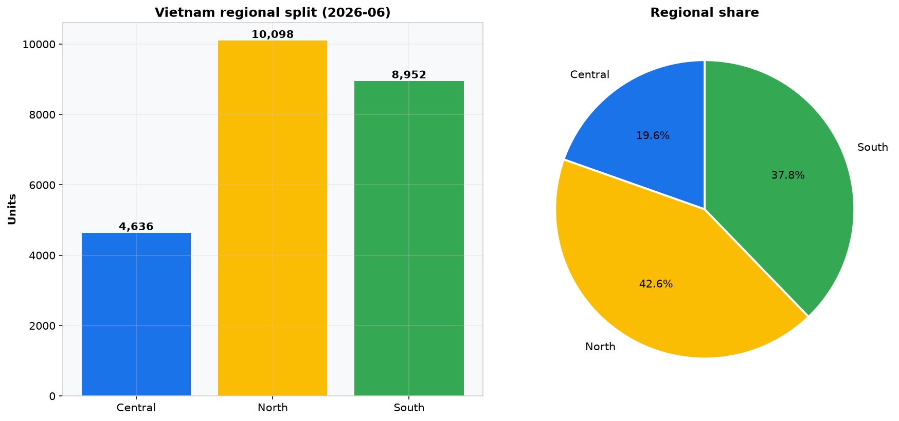

**解读**：与"越南车市集中在胡志明市（南）"的普遍印象相反，河内所在的**北部才是最大区域市场**（44%）。这可能与北部人口/GDP 集中度、以及 Toyota/Mitsubishi/Ford 等品牌在北部渠道更强有关。做越南区域策略时，应以"北 > 南 > 中"为基准，而非反之。

### 4.3 品牌与车型（2026-06）

**品牌 Top 榜（region=ALL）：**

| 排名 | 品牌 | 台数 |
| --- | --- | --- |
| 1 | Toyota | 6,494 |
| 2 | Mitsubishi | 3,158 |
| 3 | Ford | 2,741 |
| 4 | THACO KIA | 2,675 |
| 5 | THACO MAZDA | 2,361 |
| 6 | THACO TRUCK | 2,173 |
| 7 | Honda | 2,002 |
| 8 | Isuzu | 900 |
| 9 | Suzuki | 654 |
| 10 | Hino | 229 |

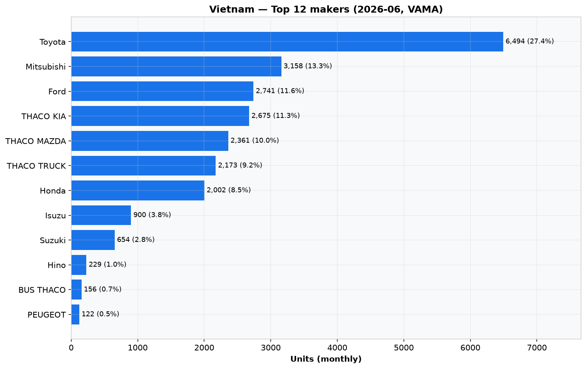

**车型 Top 榜（2026-06）：** THACO TRUCK（Truck, 2,173）、THACO MAZDA CX-5（1,144）、Mitsubishi Xforce（1,095）、Toyota Hilux（1,000）、Toyota Yaris Cross（982）、Mitsubishi Xpander（922）、Honda City（912）、Toyota Innova Cross Hybrid（884）、Ford Everest（818）、Ford Territory（784）。

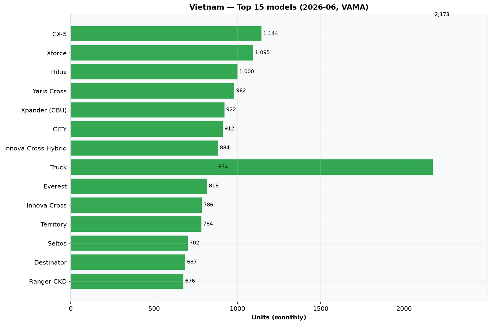

**解读**：越南市场呈"日系 + THACO 代工系（Kia/Mazda/商用车）+ 美系（Ford）"的集中结构。THACO（长海汽车）作为 CKD 组装与分销巨头，旗下 Kia/Mazda/Truck 合计占重要地位。需要强调的是，**VinFast 不在 VAMA 数据内**，故越南"新能源/BEV"的真实规模被低估——这是越南数据相对泰国的最大盲区。

### 4.4 VAMA 口径说明

VAMA 仅统计会员企业销量。VinFast（越南本土最大电动车企）、以及部分时段的 Hyundai Thanh Cong 单独发布。因此本报告越南销量 = "VAMA 会员市场"，并非越南全市场；做"越南电动化率"等结论时必须注明此口径。

---

## 五、两国对比

### 5.1 品牌重叠极小

两国共同出现的品牌仅 **5 个**：Ford、Honda、Isuzu、Suzuki、Toyota。
- 泰国品牌名 **49** 个：日系 + 中国新势力（BYD/Jaecoo/MG/GAC Aion/ChangAn/Ora…）+ 豪华（Mercedes/BMW…），高度多元。
- 越南品牌名 **15** 个：日系 + THACO 系 + 少量美系，相对集中。

### 5.2 电动化对比

- **泰国**：乘用车口径电动化 **80.9%**（BEV 22,275 单月），中国品牌是主力推手。
- **越南**：VAMA 数据**无动力类型细分**，且 VinFast（最大 BEV）不在内 → 现有数据**无法计算越南电动化率**。这是两国数据结构的关键差异，也意味着"越南电动车真实渗透率"是一个数据缺口，需另寻 VinFast 官方披露补足。

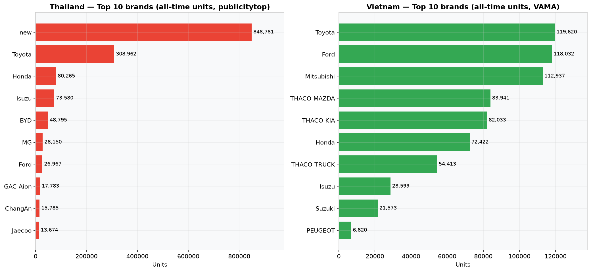　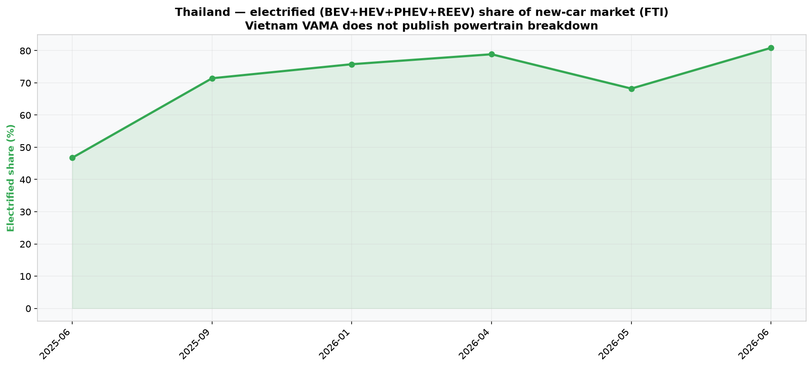

### 5.3 数据体量结构对比

| 层 | 泰国 | 越南 |
| --- | --- | --- |
| 销量（sales_monthly） | 1,286 | 12,210 |
| 挂牌（th_car_listings） | 9,575 | — |
| 新闻 | 20 | 160 |
| **合计** | **10,881** | **12,370** |

越南靠"车型级月度销量"单一高密度源即破万；泰国则靠"销量（FTI+Publicity Top）+ 挂牌（Kaidee）"多层叠加破万——方法上对应日本项目"销量 + 二手车挂牌"的双层结构。

---

## 六、数据质量与溯源

### 6.1 行数与覆盖窗口

| 表 | 行数 |
| --- | --- |
| sales_monthly | 13,496 |
| th_car_listings | 9,575 |
| news_articles | 180 |
| data_quality_flags | 28 |

- 泰国销量覆盖：FTI 2024-05~2026-06（13 个月）；Publicity Top 2024-08~2026-01（16 个月）。
- 越南销量覆盖：VAMA 2024-01~2026-06（30 个月）。

### 6.2 溯源完整性（勾稽检查）

| 表 | source | source_url | source_name | source_site | 空值数 |
| --- | --- | --- | --- | --- | --- |
| sales_monthly | 0 | 0 | 0 | 0 | 全 0 |
| th_car_listings | 0 | 0 | 0 | 0 | 全 0 |
| news_articles | 0 | — | — | 0 | 全 0 |

**结论**：两张核心表的溯源四字段零空值，每行可追溯到具体网站与发布机构。

### 6.3 一致性自检

- 车型台数之和 ≤ 品牌月总量（Publicity Top 解析的硬约束，已验证）。
- 无 `month=0` 幻影行；无 `Pos%`/`Dec1` 等假品牌行。
- 28 条 `data_quality_flags` 为已知覆盖边界的记录（如 RSS 近期窗口、SSR 上限），非数据错误。

---

## 七、结论与洞察

1. **东南亚两强，两种结构**：泰国是"日系守成 + 中国新势力强攻 + 二手车挂牌海量"的成熟多元市场；越南是"日系 + THACO 代工系主导、北部更旺、且 VinFast 在 VAMA 之外"的集中市场。
2. **中国品牌出海的"泰国样本"最具参考价值**：46.3% vs 46.2% 的日系贴身缠斗，证明中国车企已在一国市场与日系打平——这是全球汽车产业转移的标志性节点。
3. **数据基础设施价值**：本仓库把分散在 PDF/RSS/网页的东南亚车市信息，变成了一个**每月自动刷新、全溯源、带结论**的开放数据库，可直接支撑研究、商业决策与内容生产。
4. **已知缺口（后续可补）**：① 越南 VinFast/BEV 真实销量；② Kaidee 用 Playwright+住宅代理突破 SSR 上限以逼近全站 9 万；③ 泰国 Publicity Top 更晚月份（2026-02 起）的品牌/车型榜。

---

## 附：图表索引（data/analysis/）

| 文件 | 内容 |
| --- | --- |
| th_01_market_trend.png | 泰国月度总量趋势 |
| th_02_powertrain_mix.png | 泰国动力类型结构 |
| th_03_top_makers.png | 泰国品牌 Top 榜 |
| th_04_chinese_share.png | 中国品牌份额趋势 |
| th_05_top_models.png | 泰国车型 Top 榜 |
| th_06_price_distribution.png | 挂牌价格分布 |
| th_07_listing_brands.png | 挂牌品牌分布 |
| th_08_province.png | 挂牌省份分布 |
| th_09_region.png | 挂牌区域 |
| th_10_fuel_condition.png | 挂牌燃料/车况 |
| vn_01_monthly_total.png | 越南月度总量 |
| vn_02_top_makers.png | 越南品牌 Top 榜 |
| vn_03_top_models.png | 越南车型 Top 榜 |
| vn_04_region_split.png | 越南区域结构 |
| cmp_01_top_brands.png | 两国品牌结构对比 |
| cmp_02_electrification.png | 两国电动化对比 |
